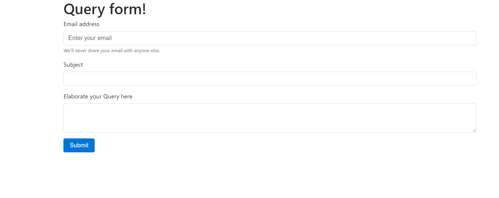

# A-simple-Query-page-using-php
This application is a form for basically asking queries to the server by providing user's details, subject and query content built using php.

<h2>Application</h2>

<h2>In action </h2>

 see this application in action <a href=" http://jayasampathwebhosting-com.stackstaging.com/projects/query-page/ ">here </a>

